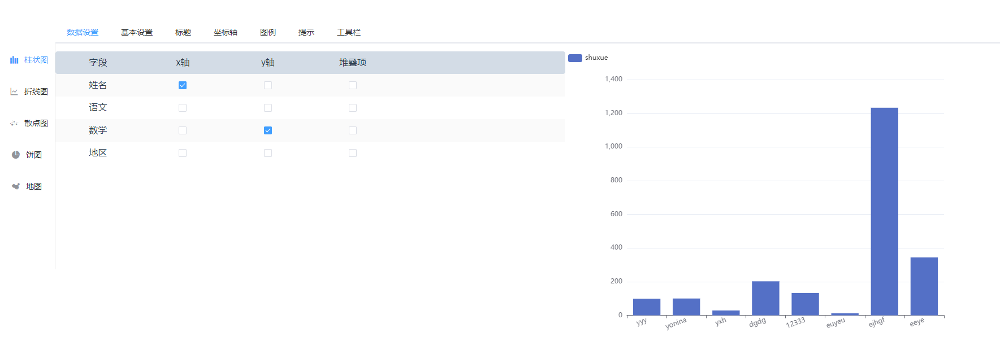

### view-for-data

**使用表格数据生成相应的图表**

例： 柱状图



#### 数据设置项
  > 根据相应的表格数据字段生成


**view-for-data需要的参数说明**

参数 | 说明 | 类型 | 是否必填 
 :-: | :-: | :-: | :-: 
 data | 表格数据 | Array | 是 
 options | 表格配置项 | Array | 是 

**options配置项参数说明**

| 参数  |       说明       |  类型  | 是否必填 |
| :---: | :--------------: | :----: | :------: |
| label | 字段显示的中文名 | string |    是    |
| props | 表格中对应的字段 | string |    是    |

*要展示地图散点图data中必须有address字段表示散点的具体位置*

例：

```js
// data 
[{
  name: 'yyy',
  yuwen: 98,
  shuxue: 99,
  address: '武汉' // 表示有一个散点展示在武汉
},
{
  name: 'yonina',
  yuwen: 100,
  shuxue: 100,
  address: '湖南' // 表示有一个散点展示在湖南
}]

// options 
[{
  label: '姓名',
  prop: 'name'
},{
  label: '语文',
  prop: 'yuwen'
},{
  label: '数学',
  prop: 'shuxue'
},{
  label: '地区',
  prop: 'address'
}]
```

