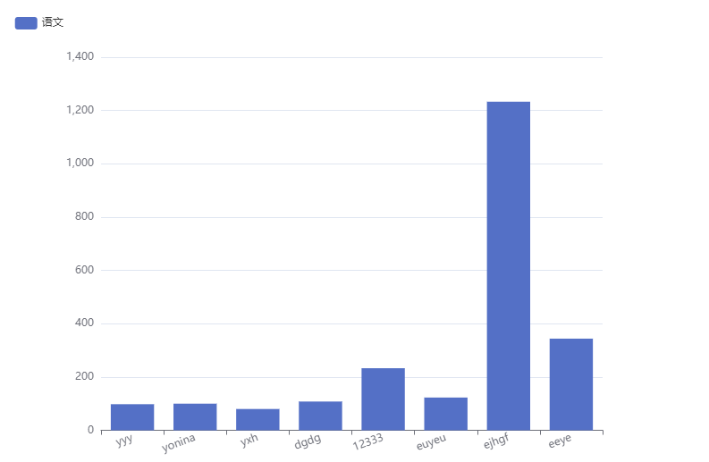

### y-auto-chart
    根据配置项生成相应的图表



```js
<y-auto-chart :options="formatOptions"></y-auto-chart>
  data: () => {
    return {
        // formatOptions是根据view-for-data导出的options
      formatOptions: {
		"dataset": {
		"dimensions": ["name", "yuwen"],
		"source": [
            {
                "name": "yyy",
                "yuwen": 98
            }, {
                "name": "yonina",
                "yuwen": 100
            }, {
                "name": "yxh",
                "yuwen": 80
            }, {
                "name": "dgdg",
                "yuwen": 108
            }, {
                "name": "12333",
                "yuwen": 233
            }, {
                "name": "euyeu",
                "yuwen": 123
            }, {
                "name": "ejhgf",
                "yuwen": 1233
            }, {
                "name": "eeye",
                "yuwen": 344
            }]
		},
        "legend": {
            "type": "scroll",
            "left": "left",
            "orient": "vertical"
        },
        "width": 600,
        "height": 400,
        "title": {
            "textAlign": "left",
            "x": "center",
            "y": "top"
        },
        "grid": {
            "top": "10%",
            "containLabel": true,
            "height": "90%"
        },
        "tooltip": {
            "trigger": "item"
        },
        "toolbox": {
            "show": true
        },
        "series": [{
            "type": "bar",
            "prop": "yuwen"
        }],
        "yAxis": {
            "type": "value"
        },
        "xAxis": {
            "type": "category",
            "show": true,
            "axisLabel": {
                "interval": 0,
                "rotate": 20
            }
        },
        "canvas": {
            "width": 700,
            "height": 500
        },
        "paddingStyle": {}
}
  },
```

​	**y-auto-chart需要的参数说明**

| 参数    | 说明                                  | 类型   | 是否必填 |
| ------- | ------------------------------------- | ------ | -------- |
| options | 根据view-for-data生成的图表数据配置项 | Object | 是       |

